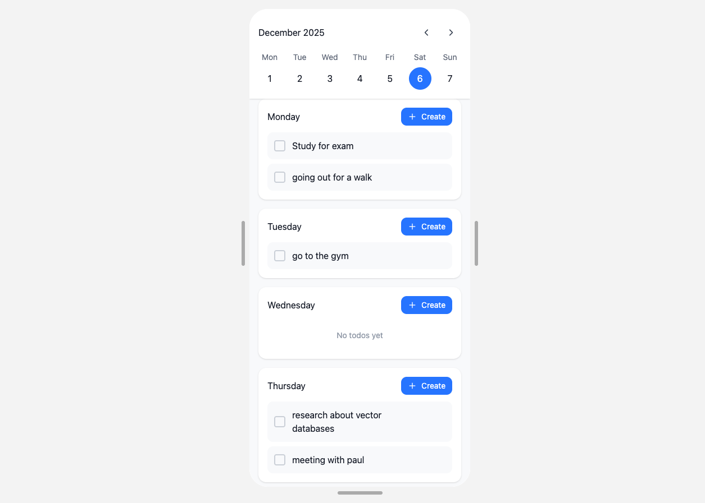

# Weeknotes
A modern, minimalist weekly todo application for myself, mainly because I like to use apps like this and to improve my skills in the Spring Framework. Its nothing special, just for personal use.

## Features
**Weekly View** - See the entire week at a glance (Monday to Sunday)

**Task Management** - Create, complete, and delete todos for each day

**Week Navigation** - Easily browse through past and future weeks (No overbloat, perfect for me)

**Mobile optimized** - Since I use it primarly on my phone

## Tech Stack
**Backend**

- Java
- Spring Boot
- PostgreSQL
- Spring Data JPA

**Frontend**

- React
- Typescript
- SWR
- Shadcn
- Tailwind
